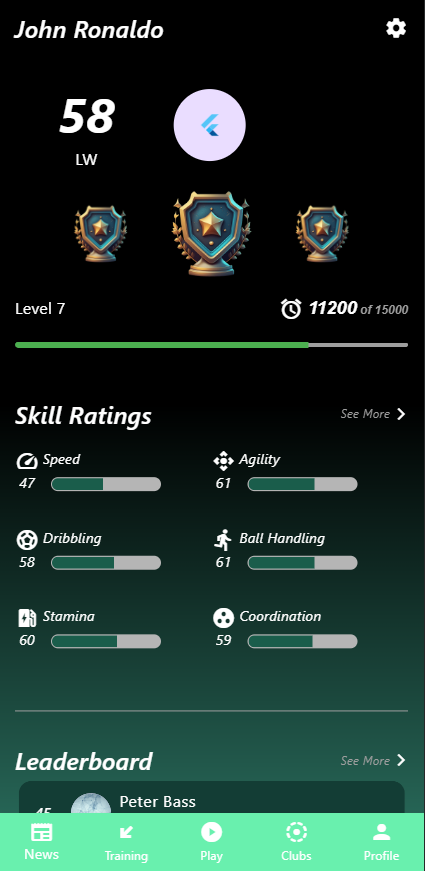

# Football UI Profile Page

## Project Architecture

Mainly focused on lib folder to build UI.
Ensured code quality : maintainability, reusability, scalability.

lib

Contains the dart files including main.dart, which is a part of an application. And also, serves as the entry point for the application.

- styles

    - `colors.dart`
    
        Defines text colors that can be used globally.

    - `text_style.dart`

        Defines text styles that can be used globally.

- widget

    - `custom_app_bar.dart`

        Shows navigation bar.

    - `score_board`

        Shows score board to show player's avatar, ability, position, etc.

    - `level_indicator.dart`

        Shows level icons, level indicator section.

    - `skill_ratings.dart`

        Shows skill ratings such as speed, agility, dribbling, ball handling, stamina, coordination.
        Defines seperated _SeeMore Class to improve code reusability.

    - `leader_board`

        Shows leaderboard and items.
        Defines seperated _LeaderBoardItem Class to improve code reusability.

    - `bottom_nav_bar`

        Shows footbar, bottom of the page.
        
    - `skill_track_shape.dart` (reusable component)

        Customized track shape that can be used in level indicator, skill ratings section.

    - `skill_progress_bar` (reusable component)

        Customized progress bar that can be used in skill ratings section.

- main.dart

    Root class of the application, contains all section classes.

assets

Contains image assets that are used in the application.
Some assets are referenced via the internet.